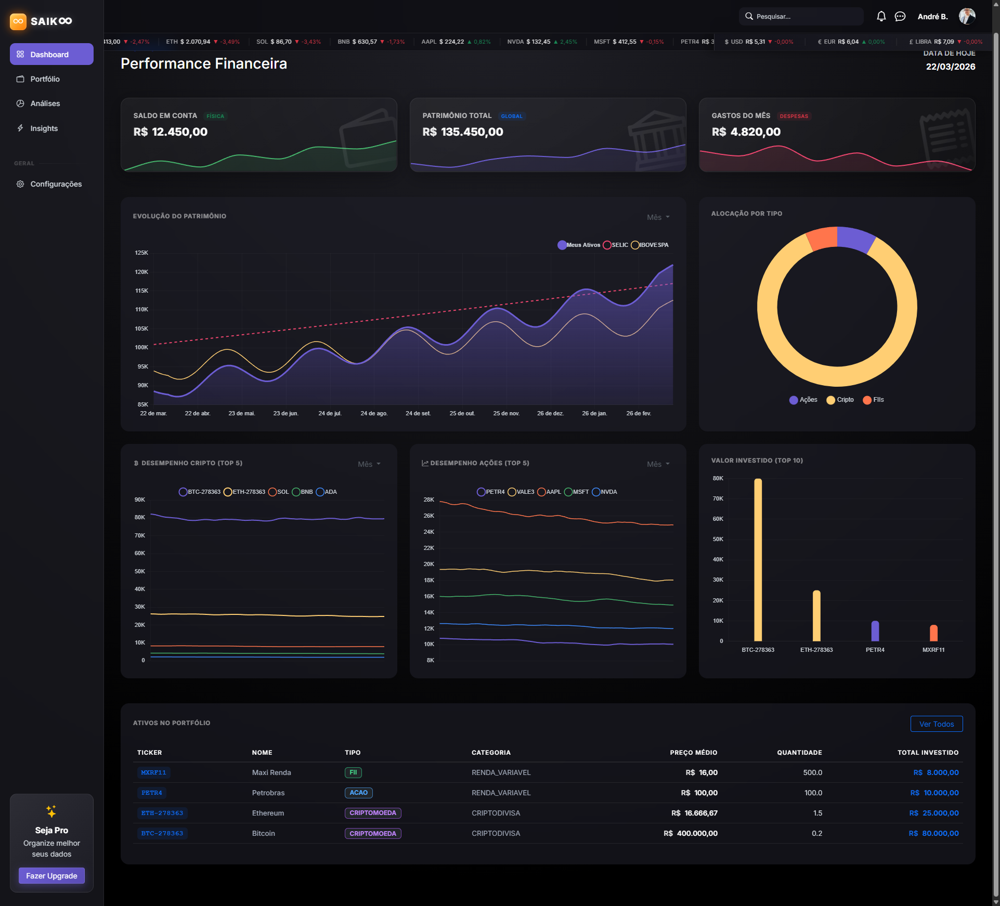

<div align="center">


# SAIKOO — Home Broker e Gestão de Ativos


[](LICENSE)

> Sistema CRUD de gestão financeira pessoal finalizado no TP5 com pipeline CI/CD completa — build, testes, SAST/DAST, cobertura JaCoCo ≥ 90%, deploy multi-ambiente com aprovação manual e testes pós-deploy Selenium.

[](https://linkedin.com/in/becker84)
[](https://www.github.com/andrebecker84/)

</div>

---

## Sumário

- [Sobre o Projeto](#sobre-o-projeto)
- [Pipeline CI/CD](#pipeline-cicd)
- [Tecnologias](#tecnologias)
- [Arquitetura](#arquitetura)
- [Testes e Cobertura](#testes-e-cobertura)
- [Como Executar](#como-executar)
- [Estrutura do Projeto](#estrutura-do-projeto)
- [Documentação Completa](#documentação-completa)
- [Autor](#autor)
- [Licença](#licença)

---

## Sobre o Projeto

O SAIKOO é um sistema CRUD de gestão financeira pessoal construído com Java 21 e Spring Boot 3.3, cobrindo o portfólio completo do investidor: Ações, FIIs, Criptomoedas, Renda Fixa, Precatórios e Ativos Reais. A interface usa dark theme inspirado em terminais profissionais de home broker.

O **TP5** é a entrega final do projeto, incorporando refatorações orientadas à imutabilidade e polimorfismo, pipeline CI/CD expandida com SAST/DAST, deploy automático para múltiplos ambientes (dev, staging, prod) com aprovação manual para produção, testes pós-deploy com Selenium e monitoramento com logs personalizados e badges de status.

---

## Pipeline CI/CD

O TP5 opera com três workflows independentes em `.github/workflows/`.

### CI — Integração Contínua (`ci.yml`)

Dispara em **todo push** (qualquer branch) e em **pull requests para main**.

```
push / pull_request
        │
        ▼
  Job 1: testes-unitarios-integracao   (timeout: 15 min)
  ├── Setup Java 21 (Temurin) + cache Maven
  ├── mvn -B clean verify -Dtest="!AtivoSeleniumTest"
  │   ├── compila o projeto
  │   ├── executa 50+ testes unitários e de integração
  │   └── JaCoCo gate — falha o build se cobertura < 90%
  ├── Análise SAST (CodeQL)
  ├── Upload: surefire-reports + jacoco-coverage-report
  └── Resumo Markdown ($GITHUB_STEP_SUMMARY)
        │
        │ (needs — só avança se job 1 passou)
        ▼
  Job 2: testes-e2e   (timeout: 10 min)
  ├── mvn -B test -Dtest=AtivoSeleniumTest
  │   └── Chrome headless (configurado no próprio teste)
  └── Upload: selenium-screenshots  (if: always)
```

### CD — Entrega Contínua (`cd.yml`)

Dispara após **CI passar com sucesso em main** ou em **push de tag `v*.*.*`**.

```
CI concluído com sucesso em main  (ou tag v*.*.*)
        │
        ▼
  Job 1: build-artefato   (timeout: 10 min)
  ├── mvn -B clean package -DskipTests
  │   └── gera saikoo-1.0.0.jar (fat-JAR Spring Boot)
  └── Upload: saikoo-jar (30 dias)
        │
        │ (needs)
        ▼
  Job 2: deploy-dev   (automático)
  └── Deploy para ambiente dev
        │
        │ (needs + tag v*.*.*-rc*)
        ▼
  Job 3: deploy-staging   (automático, aprovação não exigida)
  └── Deploy para staging + dispara pós-deploy
        │
        │ (needs + tag v*.*.* + aprovação manual)
        ▼
  Job 4: deploy-prod   (aprovação manual obrigatória)
  └── Deploy para produção
        │
        │ (needs + tag v*.*.*)
        ▼
  Job 5: release   (timeout: 5 min)
  ├── Cria GitHub Release com JAR anexado
  └── Gera changelog automático dos commits
```

### Pós-deploy — Validação em Staging (`post-deploy.yml`)

Dispara automaticamente após o CD concluir deploy em staging.

```
  Job: testes-pos-deploy   (timeout: 10 min)
  ├── Aguarda estabilização do ambiente (health check)
  ├── mvn -B test -Dtest=AtivoSeleniumPosDeployTest
  │   └── Selenium contra URL do ambiente de staging
  └── Upload: screenshots-pos-deploy  (if: always)
```

### Boas Práticas Aplicadas

| Prática | O que resolve |
| ------- | ------------- |
| `workflow_run` no CD | CD só executa após CI aprovado — impede artefato de código quebrado |
| OIDC para deploy | Elimina segredos de longa duração para autenticação com provedores de nuvem |
| Ambientes com proteção | `production` exige aprovação manual — nenhum deploy automático em prod |
| Resumos Markdown (`$GITHUB_STEP_SUMMARY`) | Resultados de testes e cobertura visíveis diretamente na UI do GitHub |
| SAST com CodeQL | Vulnerabilidades detectadas no CI antes de qualquer merge |
| Logs personalizados | `logback-spring.xml` com perfis e arquivo rotativo `saikoo-<data>.log` |
| `-B` em todos os `mvn` | Logs limpos no runner — sem ANSI colors e sem prompts interativos |
| `concurrency` com cancel | Cancela runs obsoletos em feature branches; preserva execuções em main |
| `timeout-minutes` por job | Impede que runner seja bloqueado por teste ou build travado |
| `permissions: contents: read` no CI | Princípio do menor privilégio — CI não precisa escrever no repositório |

---

## Tecnologias

| Categoria | Tecnologia | Versão | Uso |
| --------- | ---------- | ------ | --- |
| Backend | Java | 21 | Linguagem principal |
| Backend | Spring Boot | 3.3.0 | Web, Data JPA, Thymeleaf, Validation |
| Backend | H2 Database | — | Banco em memória para dev e testes |
| Frontend | Thymeleaf | SSR | Templates com arquitetura de componentes |
| Frontend | Bootstrap 5 + Icons | — | Layout responsivo e ícones |
| Frontend | Chart.js | — | Gráficos interativos no dashboard |
| Testes | JUnit 5 + Mockito | — | Testes unitários e de integração |
| Testes | Selenium WebDriver | 4.21.0 | Automação E2E no browser e pós-deploy |
| Testes | Jqwik | 1.8.5 | Property-based e fuzz testing |
| Testes | JaCoCo | 0.8.12 | Cobertura de código (mínimo 90%) |
| Segurança | CodeQL | — | Análise estática de segurança (SAST) |
| CI/CD | GitHub Actions | — | CI — build, testes, cobertura, SAST |
| CI/CD | GitHub Actions | — | CD — deploy multi-ambiente, release |
| CI/CD | GitHub Actions | — | Pós-deploy — Selenium em staging |

---

## Arquitetura

Layered Architecture com separação estrita entre Controller, Service, Repository e Model.

```
src/main/java/com/infnet/financas/
├── controller/     # Roteamento HTTP — zero lógica de negócio
├── service/        # Regras de negócio + DashboardMetrics (Java 21 record)
├── repository/     # Spring Data JPA
├── model/          # Entidade JPA + enums aninhados + getPrecoMedio()
└── exception/      # Exceções de domínio + @ControllerAdvice global
```

---

## Testes e Cobertura

### Cobertura JaCoCo

| Pacote | Cobertura de Linhas |
| ------ | ------------------- |
| `com.infnet.financas` | 100% |
| `com.infnet.financas.controller` | 100% |
| `com.infnet.financas.service` | 100% |
| `com.infnet.financas.exception` | 100% |
| `com.infnet.financas.model` | ≥ 90% |
| **Total (excl. boilerplate)** | **≥ 90% — PASS** |

### Suíte de Testes

| Classe | Tipo | Casos |
| ------ | ---- | ----- |
| `AtivoFinanceiroServiceTest` | Unitário (Mockito) | 12 |
| `AtivoControllerTest` | Unitário (MockMvc) | 17 |
| `AtivoFinanceiroRepositoryTest` | Integração (@DataJpaTest) | 7 |
| `AtivoFinanceiroTest` | Unitário (modelo) | 7 |
| `GerenciadorExcecoesGlobalTest` | Unitário | 4 |
| `HomeControllerTest` | Unitário (MockMvc) | 1 |
| `CenariosAdversosTest` | Cenários adversos | 8 |
| `AtivoFinanceiroPropriedadeTest` | Property-based (Jqwik) | 4 × 1.000 |
| `AtivoSeleniumTest` | E2E (Selenium) | 6 |
| `AtivoSeleniumPosDeployTest` | E2E pós-deploy (Selenium) | 4 |
| `SaikooApplicationTest` | Contexto Spring | 2 |

---

## Como Executar

**Pré-requisitos:** Java 21+, Maven 3.9+, Google Chrome (para testes Selenium)

```bash
# Clonar o repositório
git clone https://github.com/andrebecker84/PB_TP5.git
cd PB_TP5

# Iniciar a aplicação
mvn spring-boot:run
```

| URL | Descrição |
| --- | --------- |
| `http://localhost:8080/` | Redireciona para o dashboard |
| `http://localhost:8080/ativos/dashboard` | Dashboard financeiro |
| `http://localhost:8080/ativos` | Gestão de Ativos (CRUD) |
| `http://localhost:8080/h2-console` | Console H2 (dev) |

```bash
# Suíte completa + relatório JaCoCo
mvn clean verify

# Apenas testes unitários e de integração (sem Selenium)
mvn clean verify -Dtest="!AtivoSeleniumTest" -DfailIfNoTests=false

# Apenas testes Selenium
mvn test -Dtest=AtivoSeleniumTest -DfailIfNoTests=false
```

**Artefatos locais após `mvn clean verify`:**

| Artefato | Local |
| -------- | ----- |
| Cobertura JaCoCo | `target/site/jacoco/index.html` |
| Screenshots Selenium | `src/test/resources/screenshots/` |
| Log da aplicação | `logs/saikoo-<data-hora>.log` |

---

## Demonstração Visual

<div align="center">



*Dashboard financeiro capturado durante execução do teste E2E Selenium — `shouldVisitDashboardWithCharts`*

</div>

---

## Estrutura do Projeto

```
PB_TP5/
├── .github/
│   └── workflows/
│       ├── ci.yml                 # Pipeline CI (build, testes, SAST, cobertura)
│       ├── cd.yml                 # Pipeline CD (deploy multi-ambiente, release)
│       └── post-deploy.yml        # Testes pós-deploy Selenium em staging
├── doc/
│   ├── DOCUMENTACAO_PB_TP5.md
│   └── images/
│       └── card.svg
├── src/
│   ├── main/
│   │   ├── java/com/infnet/financas/
│   │   │   ├── SaikooApplication.java
│   │   │   ├── controller/
│   │   │   ├── service/
│   │   │   ├── repository/
│   │   │   ├── model/
│   │   │   └── exception/
│   │   └── resources/
│   │       ├── templates/
│   │       ├── static/
│   │       ├── logback-spring.xml
│   │       └── application.properties
│   └── test/
│       └── java/com/infnet/financas/
│           ├── SaikooApplicationTest.java
│           ├── unit/
│           └── selenium/
│               ├── AtivoSeleniumTest.java
│               ├── AtivoSeleniumPosDeployTest.java
│               └── pageobjects/
├── pom.xml
├── LICENSE
└── README.md
```

---

## Documentação Completa

Consulte a documentação técnica detalhada em [`doc/DOCUMENTACAO_PB_TP5.md`](doc/DOCUMENTACAO_PB_TP5.md).

---

## Autor

<div align="center">

[](https://github.com/andrebecker84)

</div>

---

## Licença

MIT — André Luis Becker. Consulte o arquivo [LICENSE](LICENSE).
