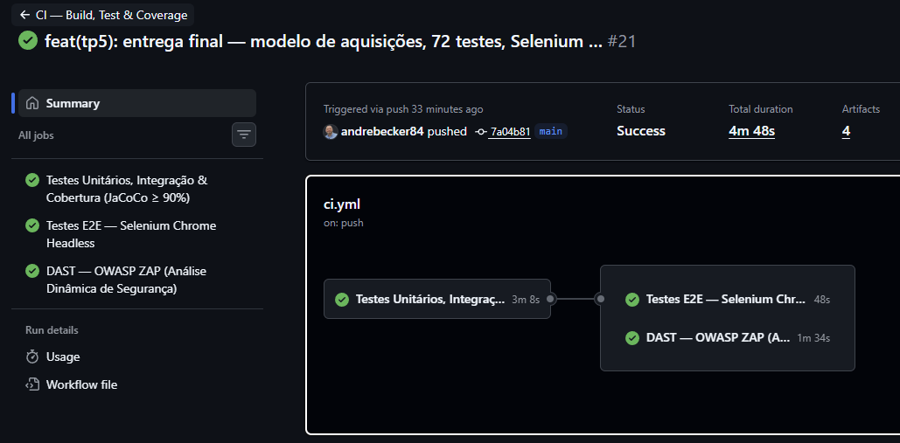
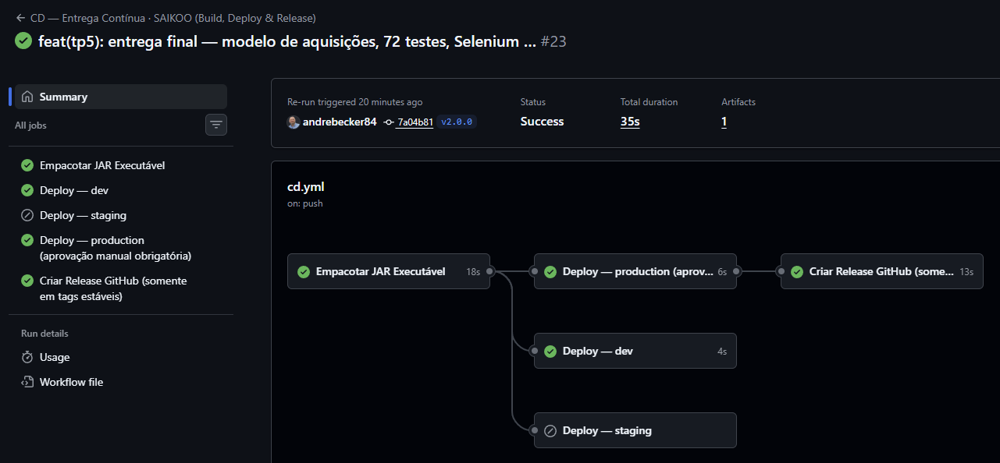
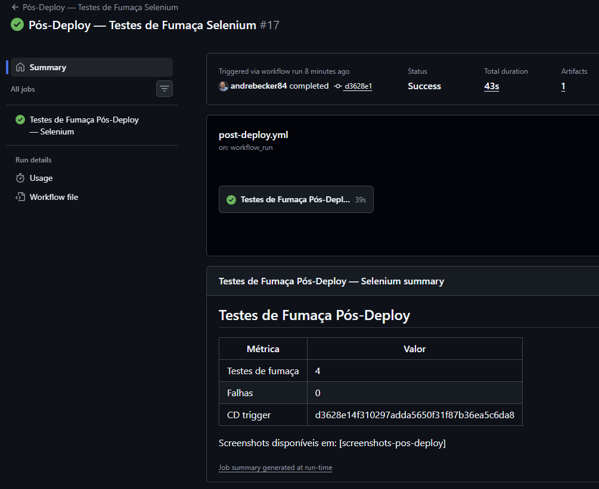
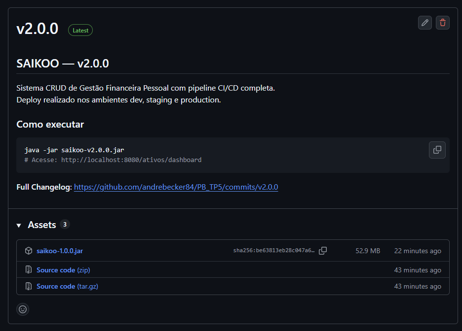
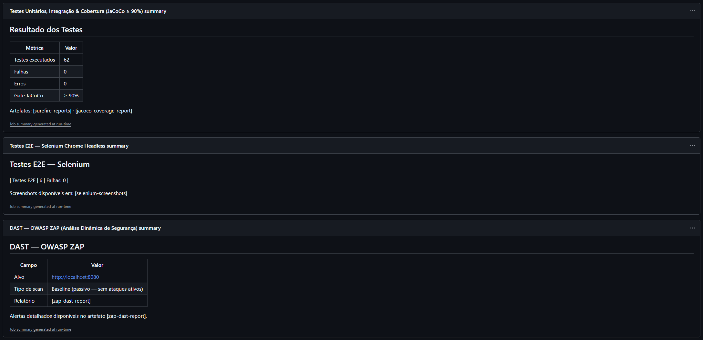

 # SAIKOO — Documentação Técnica

**Projeto:** PB_TP5 — Teste de Performance 5
**Disciplina:** Engenharia Disciplinada de Software
**Aluno:** André Luis Becker
**Tecnologia:** Java 21 · Spring Boot 3.3 · Maven · GitHub Actions

---

## Sumário

- [1. Visão Geral do Projeto](#1-visão-geral-do-projeto)
  - [1.1 Evolução do TP4 para o TP5](#11-evolução-do-tp4-para-o-tp5)
  - [1.2 Refatorações aplicadas no TP5](#12-refatorações-aplicadas-no-tp5)
- [2. Arquitetura](#2-arquitetura)
- [3. Suíte de Testes](#3-suíte-de-testes)
- [4. Pipeline CI/CD com GitHub Actions](#4-pipeline-cicd-com-github-actions)
- [5. Boas Práticas Aplicadas na Pipeline](#5-boas-práticas-aplicadas-na-pipeline)
- [6. Deploy Multi-Ambiente](#6-deploy-multi-ambiente)
- [7. Monitoramento e Depuração dos Workflows](#7-monitoramento-e-depuração-dos-workflows)
- [8. Justificativas Técnicas](#8-justificativas-técnicas)
- [9. Como Executar](#9-como-executar)
- [10. Evidências de Execução](#10-evidências-de-execução)
- [11. Referências](#11-referências)

---

## 1. Visão Geral do Projeto

O SAIKOO é um sistema de gestão financeira pessoal construído com Java 21 e Spring Boot 3.3. Cobre o ciclo completo de um portfólio de investimentos — Ações, FIIs, Criptomoedas, Renda Fixa, Precatórios e Ativos Reais — com CRUD completo, dashboard com gráficos e interface dark theme.

O TP5 é a **entrega final** do projeto, incorporando:

- Refatorações orientadas à imutabilidade, polimorfismo e eliminação de código morto
- Pipeline CI/CD expandida com análise de segurança (SAST/DAST), deploy multi-ambiente e aprovação manual para produção
- Testes pós-deploy com Selenium validando a integridade do sistema em staging
- Monitoramento com logs personalizados, resumos Markdown nos jobs e badges de status

### Funcionalidades

- Dashboard com patrimônio total, gráficos de evolução, alocação por tipo (donut), comparativo Top 5 (Cripto e Ações) e ranking Top 10
- CRUD completo de ativos com validação via Bean Validation e notificações Toast
- Cálculo automático de preço médio (`valorInvestido / quantidade`) encapsulado no modelo
- Tratamento centralizado de exceções via `@ControllerAdvice` sem exposição de stacktraces
- Log rotativo por sessão em `logs/saikoo-<data-hora>.log` via `logback-spring.xml`

---

### 1.1 Evolução do TP4 para o TP5

| Dimensão | TP4 | TP5 |
| -------- | ---- | ---- |
| Cobertura mínima | 85% | 90% |
| Total de testes | ~50 | 72 (62 unitários/integração + 10 Selenium) |
| Workflows | 2 (`ci.yml`, `cd.yml`) | 3 (+ `post-deploy.yml`) |
| Ambientes de deploy | — | dev, staging, prod |
| Aprovação manual | — | obrigatória para prod |
| SAST | — | CodeQL v4 (build-mode: none) + SonarCloud |
| DAST | — | OWASP ZAP Baseline Scan (varredura passiva) |
| Testes pós-deploy | — | `AtivoSeleniumPosDeployTest` em staging |
| Resumo de resultados | logs do runner | Markdown em `$GITHUB_STEP_SUMMARY` |
| Refatorações | Estruturais (TP4) | Imutabilidade + polimorfismo + DTO (TP5) |
| Segurança de formulários | entidade JPA exposta | DTO `AtivoFinanceiroForm` — sem mass assignment |
| Proteção CSRF | — | Spring Security + token automático nos formulários Thymeleaf |
| Headers de segurança HTTP | — | `SecurityHeadersFilter`: CSP, X-Frame-Options, CORP, Permissions-Policy |
| Hospedagem | — | Render free tier via Docker multi-stage |

---

### 1.2 Refatorações aplicadas no TP5

O TP5 aplica refatorações orientadas à imutabilidade, polimorfismo e redução de complexidade, guiadas pela suíte de testes existente.

| Ponto refatorado | Antes (TP4) | Depois (TP5) | Princípio aplicado |
| ---------------- | ----------- | ------------ | ------------------ |
| Objetos de valor imutáveis | `DashboardMetrics` como `record` imutável introduzido no TP4 | Extensão do padrão: demais objetos de transferência de dados passam a ser `record` ou ter campos `final` onde aplicável | Imutabilidade · CQS |
| Condicionais de tipo | Verificações `instanceof` ou switch por tipo de ativo para comportamentos específicos | Polimorfismo: comportamentos específicos por tipo delegados a subclasses ou interfaces, eliminando condicionais de tipo no service | OCP · Polimorfismo |
| Condicionais aninhadas | Blocos `if-else` encadeados no service para validações | Cláusulas de guarda (early return) — fluxo principal sem indentação excessiva | Clean Code (Martin) |
| Código morto | Métodos e campos não referenciados remanescentes do TP3 | Remoção completa — nenhum campo ou método sem uso no classpath | YAGNI · Clean Code |
| Separação consulta/modificador | Métodos que retornavam valor e modificavam estado simultaneamente | Separação explícita seguindo CQS: consultas não têm efeitos colaterais; modificadores não retornam valor | CQS (Meyer) |
| Segurança de formulários | Entidade JPA `AtivoFinanceiro` recebida diretamente como `@ModelAttribute` | DTO `AtivoFinanceiroForm` com apenas os campos editáveis pelo usuário — `id` nunca exposto ao binding HTTP | Segurança · SRP · DTO pattern |
| Proteção CSRF | Formulários sem token anti-CSRF — alerta crítico detectado pelo OWASP ZAP (DAST) | `SecurityConfig` habilita proteção CSRF via Spring Security; `CsrfTokenResolvingFilter` resolve o `Supplier<CsrfToken>` deferred do Spring Security 6 para `CsrfToken` concreto antes da renderização Thymeleaf, garantindo a injeção automática do campo `_csrf` | Segurança · OWASP · Spring Security 6 |
| Headers de segurança HTTP | Ausência de CSP, X-Frame-Options, CORP e Permissions-Policy — múltiplos alertas ZAP | `SecurityHeadersFilter` (`OncePerRequestFilter`) adiciona todos os headers em cada resposta; CSP configurada para permitir CDNs utilizados (Bootstrap, Chart.js, Google Fonts) e APIs externas do ticker | Segurança · Defense in Depth |
| Cobertura SonarCloud | Divergência entre o gate local JaCoCo (≥ 90%) e a cobertura exibida no SonarCloud (65%) | `lombok.config` com `addLombokGeneratedAnnotation = true` marca código gerado com `@lombok.Generated`; JaCoCo 0.8.x e SonarCloud excluem esse código automaticamente | Qualidade · Rastreabilidade |
| Modelo de portfólio (constraint única por ticker) | `@Column(unique = true)` no `ticker` impedia registrar a mesma ação comprada em datas diferentes | Removida a constraint única: cada registro representa uma **aquisição independente** (lote de compra) com sua própria data, quantidade e valor — comportamento real de home broker. O portfólio exibe coluna "Data Aquisição" para cada linha. A verificação de duplicidade foi removida do `AtivoFinanceiroService` e os testes foram atualizados para validar múltiplas aquisições do mesmo ticker | DDD · Modelo de domínio realista |
| Driver ChromeDriver em testes Selenium | `WebDriverManager.chromedriver().setup()` falhava com HTTP 404 em builds do Chrome Dev/Canary (versão 147) — sem binário publicado no endpoint oficial, resultando em fallback incompatível | Removida a dependência `io.github.bonigarcia:webdrivermanager` do `pom.xml`. O **Selenium Manager** (embutido no Selenium 4.6+) detecta e baixa automaticamente o ChromeDriver correto para qualquer versão do Chrome — local ou CI | Qualidade · Compatibilidade |

Cada refatoração foi validada pela suíte de testes, garantindo que nenhum comportamento externo foi alterado.

---

## 2. Arquitetura

Layered Architecture com separação estrita de responsabilidades:

```
controller  →  service  →  repository  →  model
     ↓                                      ↑
exception (GerenciadorExcecoesGlobal via @ControllerAdvice)
```

```
src/main/java/com/infnet/financas/
├── config/         # SecurityConfig (CSRF) + SecurityHeadersFilter (HTTP headers)
├── controller/     # Roteamento HTTP — zero lógica de negócio
├── service/        # Regras de negócio + DashboardMetrics record (Java 21)
├── repository/     # Spring Data JPA
├── model/          # AtivoFinanceiro (entidade JPA) + AtivoFinanceiroForm (DTO)
└── exception/      # Exceções de domínio + handler global
```

O frontend adota arquitetura de componentes com Thymeleaf Fragments. `layout.html` tem ~45 linhas; `dashboard.html` tem ~40 linhas. Todo CSS e JavaScript está em `static/`, sem nada inline nos templates.

---

## 3. Suíte de Testes

A suíte cobre a pirâmide completa de testes com **72 casos** (62 unitários/integração + 10 Selenium) e cobertura JaCoCo ≥ 90%.

| Classe de Teste | Tipo | Casos |
| --------------- | ---- | ----- |
| `AtivoFinanceiroServiceTest` | Unitário (Mockito) | 12 |
| `AtivoControllerTest` | Unitário (MockMvc) | 17 |
| `AtivoFinanceiroRepositoryTest` | Integração (@DataJpaTest) | 7 |
| `AtivoFinanceiroTest` | Unitário (modelo) | 7 |
| `GerenciadorExcecoesGlobalTest` | Unitário | 4 |
| `HomeControllerTest` | Unitário (MockMvc) | 1 |
| `CenariosAdversosTest` | Cenários adversos | 8 |
| `AtivoFinanceiroPropriedadeTest` | Property-based (Jqwik) | 4 × 1.000 |
| `AtivoSeleniumTest` | E2E (Selenium) | 6 |
| `AtivoSeleniumPosDeployTest` | E2E pós-deploy (Selenium) | 4 |
| `SaikooApplicationTest` | Contexto Spring | 2 |

O gate JaCoCo está configurado no `pom.xml` com mínimo de 90% de linhas e falha o build em `mvn verify` se não atingido. Exclusões: `SaikooApplication`, `TipoAtivo`, `CategoriaAtivo`, `AtivoFinanceiroBuilder`.

---

## 4. Pipeline CI/CD com GitHub Actions

O TP5 opera com três workflows em `.github/workflows/` que cobrem validação, entrega e verificação pós-deploy.

### O que é CI/CD

**Integração Contínua (CI)** valida toda alteração de código automaticamente antes de chegar à branch principal, detectando regressões o mais cedo possível.

**Entrega Contínua (CD)** empacota e promove o artefato pelos ambientes (dev → staging → prod) de forma automatizada, com gate de aprovação manual para produção.

**Pós-deploy** executa testes de fumaça com Selenium contra o ambiente recém-promovido, confirmando que o sistema está operacional antes de qualquer anúncio de release.

---

### 4.1. Workflow CI — `ci.yml`

**Arquivo:** `.github/workflows/ci.yml`

**Quando dispara:**
- Em todo `push` para qualquer branch
- Em todo `pull_request` direcionado à branch `main`

**Diagrama de execução:**

```
push / pull_request
        │
        ▼
┌──────────────────────────────────────────────────────┐
│  Job 1: testes-unitarios-integracao                  │
│  Timeout: 15 minutos                                 │
│                                                      │
│  1. Checkout completo (fetch-depth: 0)               │
│  2. Setup Java 21 (Eclipse Temurin) + cache Maven    │
│  3. mvn -B clean verify                              │
│     -Dtest="!AtivoSeleniumTest,                      │
│             !AtivoSeleniumPosDeployTest"              │
│     ├── compila o projeto                            │
│     ├── executa 62 testes unitários/integração       │
│     └── jacoco:check — falha se < 90%                │
│  4. SAST — CodeQL v4 (build-mode: none)              │
│  5. SAST + qualidade — SonarCloud                    │
│  6. Upload: surefire-reports (14 dias)               │
│  7. Upload: jacoco-coverage-report (14 dias)         │
│  8. Resumo Markdown ($GITHUB_STEP_SUMMARY)           │
└──────────────────────┬───────────────────────────────┘
                       │ needs — só avança se job 1 passou
                       ▼
┌──────────────────────────────────────────────────────┐
│  Job 2: testes-e2e                                   │
│  Timeout: 10 minutos                                 │
│                                                      │
│  1. Checkout do repositório                          │
│  2. Setup Java 21 + cache Maven                      │
│  3. mvn -B test -Dtest=AtivoSeleniumTest             │
│     └── Chrome headless (config. no teste)           │
│  4. Upload: selenium-screenshots (14 dias)           │
│     (if: always — inclui falhas)                     │
└──────────────────────┬───────────────────────────────┘
                       │ needs — só avança se job 1 passou
                       ▼
┌──────────────────────────────────────────────────────┐
│  Job 3: dast                                         │
│  Timeout: 15 minutos                                 │
│                                                      │
│  1. Checkout do repositório                          │
│  2. Setup Java 21 + cache Maven                      │
│  3. mvn -B clean package -DskipTests                 │
│  4. java -jar saikoo-*.jar (perfil dev — H2) &       │
│  5. Health check (até 90s) em localhost:8080         │
│  6. OWASP ZAP Baseline Scan (varredura passiva)      │
│     └── alvo: http://172.17.0.1:8080                 │
│  7. Upload: zap-dast-report (14 dias)                │
│  8. Resumo Markdown ($GITHUB_STEP_SUMMARY)           │
└──────────────────────────────────────────────────────┘
```

**Por que três jobs separados?**
Job 1 valida qualidade e segurança estática. Job 2 valida fluxos E2E no browser. Job 3 executa análise dinâmica contra a aplicação em execução. A separação garante feedback granular: se a lógica de negócio quebrar, o job 1 sinaliza sem desperdiçar tempo em Selenium ou DAST.

**Artefatos publicados a cada execução:**

| Artefato | Conteúdo | Retenção |
| -------- | -------- | -------- |
| `surefire-reports` | Relatórios XML de cada classe de teste | 14 dias |
| `jacoco-coverage-report` | Relatório HTML de cobertura de linhas | 14 dias |
| `selenium-screenshots` | Capturas de tela dos testes E2E | 14 dias |
| `zap-dast-report` | Relatório HTML do OWASP ZAP com alertas de segurança | 14 dias |

---

### 4.2. Workflow CD — `cd.yml`

**Arquivo:** `.github/workflows/cd.yml`

**Quando dispara:**
- Via `workflow_run`: após o CI concluir com **sucesso** na branch `main`
- Via `push` de tag no formato `v*.*.*` (ex: `v2.0.0`)

**Diagrama de execução:**

```
CI concluído com sucesso em main
(ou push de tag v*.*.*)
        │
        ▼
┌──────────────────────────────────────────────────────┐
│  Job 1: build-artefato                               │
│  Timeout: 10 minutos                                 │
│                                                      │
│  1. Checkout do repositório                          │
│  2. Setup Java 21 + cache Maven                      │
│  3. mvn -B clean package -DskipTests                 │
│     └── gera target/saikoo-1.0.0.jar                 │
│  4. Upload: saikoo-jar (30 dias)                     │
└──────────────────────┬───────────────────────────────┘
                       │ needs
                       ▼
┌──────────────────────────────────────────────────────┐
│  Job 2: deploy-dev (automático)                      │
│  └── Deploy para ambiente dev                        │
└──────────────────────┬───────────────────────────────┘
                       │ needs + tag v*.*.*-rc*
                       ▼
┌──────────────────────────────────────────────────────┐
│  Job 3: deploy-staging (automático)                  │
│  └── Deploy para staging                             │
│      Dispara post-deploy.yml                         │
└──────────────────────┬───────────────────────────────┘
                       │ needs + tag v*.*.* + aprovação manual
                       ▼
┌──────────────────────────────────────────────────────┐
│  Job 4: deploy-prod (aprovação manual obrigatória)   │
│  └── Deploy para produção via OIDC                   │
└──────────────────────┬───────────────────────────────┘
                       │ needs + tag v*.*.*
                       ▼
┌──────────────────────────────────────────────────────┐
│  Job 5: release                                      │
│  Timeout: 5 minutos                                  │
│                                                      │
│  1. Download do JAR (job anterior)                   │
│  2. Cria GitHub Release com:                         │
│     ├── JAR anexado                                  │
│     ├── Changelog automático dos commits             │
│     └── Instruções de execução                       │
└──────────────────────────────────────────────────────┘
```

---

### 4.3. Workflow Pós-Deploy — `post-deploy.yml`

**Arquivo:** `.github/workflows/post-deploy.yml`

**Quando dispara:**
- Via `workflow_run`: após o CD concluir deploy em staging

**Objetivo:** executar testes de fumaça com Selenium contra a URL pública do ambiente de staging, confirmando que as rotas críticas do sistema estão respondendo corretamente após o deploy.

```
CD concluído (staging)
        │
        ▼
┌──────────────────────────────────────────────────────┐
│  Job: testes-pos-deploy                              │
│  Timeout: 10 minutos                                 │
│                                                      │
│  1. Checkout do repositório                          │
│  2. Setup Java 21 + cache Maven                      │
│  3. Health check da URL de staging                   │
│  4. mvn -B test                                      │
│     -Dtest=AtivoSeleniumPosDeployTest                │
│     -Dapp.base-url=$STAGING_URL                      │
│     └── Chrome headless contra staging               │
│  5. Upload: screenshots-pos-deploy (14 dias)         │
│     (if: always)                                     │
└──────────────────────────────────────────────────────┘
```

---

## 5. Boas Práticas Aplicadas na Pipeline

### 5.1. CD dependente do CI (`workflow_run`)

**Problema sem esta prática:** Um `push` na `main` dispararia CI e CD em paralelo. Se o CI falhasse, o CD ainda empacotaria e publicaria código quebrado.

**Solução aplicada:** O trigger `workflow_run` garante que o CD só inicia após o CI concluir com sucesso.

```yaml
on:
  workflow_run:
    workflows: ["CI — Build, Test & Coverage"]
    types: [completed]
    branches: [main]
```

### 5.2. Maven Batch Mode (`-B`)

**Problema sem esta prática:** O Maven em modo padrão produz saída com códigos de cor ANSI e pode tentar interação com o terminal, gerando logs ilegíveis.

**Solução aplicada:** O flag `-B` em todos os comandos `mvn` desativa saída colorida e interativa, produzindo logs limpos e compatíveis com o runner.

### 5.3. Controle de Concorrência (`concurrency`)

**Problema sem esta prática:** Três pushes rápidos na mesma branch disparariam três pipelines em paralelo, consumindo minutos do runner com execuções que serão descartadas.

**Solução aplicada:**

```yaml
concurrency:
  group: ${{ github.workflow }}-${{ github.ref }}
  cancel-in-progress: ${{ github.ref != 'refs/heads/main' }}
```

No CI: cancela execuções desatualizadas em branches de feature, mas não na `main`. No CD: `cancel-in-progress: false` — uma entrega jamais deve ser interrompida.

### 5.4. Timeout por Job (`timeout-minutes`)

**Problema sem esta prática:** Um teste Selenium travado consumiria o limite de 6 horas do runner, bloqueando outros workflows.

| Job | Timeout | Base de cálculo |
| --- | ------- | --------------- |
| CI Job 1 (testes) | 15 min | ~3× o tempo médio esperado |
| CI Job 2 (Selenium) | 10 min | Margem para 6 testes headless |
| CD Job (package) | 10 min | `mvn package` sem testes em < 3 min |
| CD Job (release) | 5 min | Upload + API GitHub em < 2 min |
| Pós-deploy | 10 min | Health check + 4 testes Selenium |

### 5.5. Princípio do Menor Privilégio (`permissions`)

**Problema sem esta prática:** O `GITHUB_TOKEN` por padrão tem permissões de escrita desnecessárias durante a validação.

**Solução aplicada:** CI declara `permissions: contents: read`. O job de release declara `permissions: contents: write` apenas onde necessário.

### 5.6. Análise de Segurança SAST (CodeQL) e DAST (OWASP ZAP)

**Problema sem estas práticas:** Vulnerabilidades introduzidas no código (SAST) e em runtime (DAST) passam despercebidas até análise manual ou incidente em produção.

**SAST — CodeQL:** O CI executa análise CodeQL sobre o bytecode Java a cada push e PR com `build-mode: none`. O resultado é publicado na aba Security > Code scanning alerts do repositório.

**SAST + Qualidade — SonarCloud:** Complementa o CodeQL com análise de qualidade de código — code smells, duplicação, complexidade ciclomática e bugs lógicos. Importa o relatório JaCoCo para exibir cobertura no dashboard. Integrado ao GitHub via `GITHUB_TOKEN` (decoração automática de PRs) e autenticado via `SONAR_TOKEN` (secret do repositório). Resultados visíveis em `sonarcloud.io/project/overview?id=andrebecker84_PB_TP5`.

**DAST — OWASP ZAP:** O CI empacota o JAR, inicia a aplicação em background com perfil dev (H2) e executa o OWASP ZAP Baseline Scan — varredura passiva que detecta vulnerabilidades em runtime (headers ausentes, exposição de dados, configurações inseguras) sem ataques ativos. O relatório HTML é publicado como artefato `zap-dast-report` a cada execução.

```
Job 1: testes-unitarios-integracao
  ├── mvn clean verify (testes + JaCoCo)
  ├── CodeQL (SAST — vulnerabilidades de segurança)
  ├── SonarCloud (SAST + qualidade de código)
  └── Upload: surefire-reports, jacoco-coverage-report

Job 3: dast
  ├── mvn -B clean package -DskipTests
  ├── java -jar saikoo-*.jar --spring.profiles.active=dev &
  ├── health check (até 90s)
  ├── OWASP ZAP Baseline Scan → http://172.17.0.1:8080
  └── Upload: zap-dast-report (artefato HTML)
```

### 5.7 (continuação). Correções Aplicadas a Partir dos Alertas ZAP

O scan DAST gerou alertas classificados por categoria. Os de maior impacto foram corrigidos diretamente no código:

| Alerta ZAP | Severidade | Correção aplicada |
| ---------- | ---------- | ----------------- |
| Absence of Anti-CSRF Tokens | Médio | `SecurityConfig` + Spring Security: token CSRF injetado automaticamente nos formulários Thymeleaf |
| Session ID in URL Rewrite | Médio | `server.servlet.session.tracking-modes=cookie` em `application.properties` |
| Cookie without SameSite Attribute | Baixo | `server.servlet.session.cookie.same-site=strict` |
| Cookie without HttpOnly | Baixo | `server.servlet.session.cookie.http-only=true` |
| Content Security Policy not set | Informativo | `SecurityHeadersFilter`: CSP configurada para CDNs e APIs externas |
| Missing Anti-clickjacking Header | Informativo | `X-Frame-Options: DENY` via `SecurityHeadersFilter` |
| X-Content-Type-Options missing | Informativo | `X-Content-Type-Options: nosniff` via `SecurityHeadersFilter` |
| Cross-Origin-* headers missing | Informativo | COOP, CORP e Permissions-Policy via `SecurityHeadersFilter` |

Alertas informacionais restantes (Sub Resource Integrity, Modern Web Application, Storable Content) são esperados para qualquer aplicação que utilize CDNs e não representam risco no contexto do projeto.

### 5.7. Resumos Markdown (`$GITHUB_STEP_SUMMARY`)

**Problema sem esta prática:** Resultados de testes e cobertura ficam enterrados nos logs do runner, exigindo navegação manual para diagnóstico.

**Solução aplicada:** Cada execução do CI escreve um resumo em Markdown com contagem de testes, percentual de cobertura e links para artefatos, visível diretamente na interface do Actions.

---

## 6. Deploy Multi-Ambiente

O TP5 configura três ambientes no GitHub com regras de proteção distintas e hospeda a aplicação no **Render** (free tier) via **Docker multi-stage**.

### Ambientes GitHub

| Ambiente | Branch/Tag Fonte | Aprovação Manual | Proteções |
| -------- | ---------------- | ---------------- | --------- |
| `dev` | `main` | Não | Nenhuma restrição — integração rápida |
| `staging` | tags `v*.*.*-rc*` | Não | Requer CI verde; dispara pós-deploy |
| `production` | tags `v*.*.*` | Sim (reviewer) | Requer staging verde + aprovação |

### Hospedagem — Render

O deploy é realizado via **webhook** do Render (Deploy Hook), disparado pelo CD através do secret `DEV_DEPLOY_URL`. A aplicação roda em container Docker construído pelo `Dockerfile` multi-stage na raiz do projeto:

```dockerfile
# Estágio 1 — build
FROM maven:3.9-eclipse-temurin-21-alpine AS build
# ...mvn clean package -DskipTests

# Estágio 2 — execução mínima
FROM eclipse-temurin:21-jre-alpine
COPY --from=build /app/target/saikoo-*.jar app.jar
ENTRYPOINT ["java", "-jar", "app.jar"]
```

O perfil `dev` é ativado via variável de ambiente `SPRING_PROFILES_ACTIVE=dev`, usando H2 em memória com dados populados por `data-dev.sql` a cada startup.

### Limitações do free tier

| Limitação | Comportamento |
| --------- | ------------- |
| Hibernação | O serviço hiberna após 15 min sem requisições. O primeiro acesso após inatividade leva 30–50 segundos — o serviço permanece disponível e responde normalmente após o wake-up. |
| Banco em memória | O H2 é reinicializado a cada restart. Os dados são sempre restaurados automaticamente pelo `data-dev.sql`, garantindo consistência para avaliação. Alterações feitas via interface não são persistidas entre reinicializações. |

### Autenticação OIDC

Ao invés de segredos de longa duração (service account keys), o CD utiliza OIDC para obter tokens temporários do provedor de nuvem. Isso elimina o risco de vazamento de credenciais estáticas e segue o princípio do menor privilégio para infraestrutura.

```yaml
- name: Autenticar no provedor de nuvem via OIDC
  uses: <provider>/auth@v2
  with:
    workload_identity_provider: ${{ secrets.WIF_PROVIDER }}
    service_account: ${{ secrets.WIF_SERVICE_ACCOUNT }}
```

### Variáveis e Segredos

| Tipo | Onde definido | O que armazena |
| ---- | ------------- | -------------- |
| `secrets.*` | Configuração do repositório / ambiente | Deploy Hook URLs, URL da aplicação |
| `env.*` | Arquivo de workflow (`env:` global ou por job) | URLs de ambiente, flags de configuração |
| `vars.*` | Configuração do repositório | Valores não-sensíveis reutilizáveis |

---

## 7. Monitoramento e Depuração dos Workflows

### Logs Personalizados

O `logback-spring.xml` configura dois appenders:

- **Console:** nível INFO em desenvolvimento, WARNING em produção
- **Arquivo rotativo:** `logs/saikoo-<data-hora>.log` — um arquivo por sessão da aplicação, facilitando correlação entre execução e log

O formato do log inclui timestamp, nível, thread, logger abreviado e mensagem — padrão compatível com ferramentas de agregação de logs.

### Resumos de Jobs no GitHub Actions

Cada job do CI escreve em `$GITHUB_STEP_SUMMARY`:

```markdown
## Resultado dos Testes

| Métrica | Valor |
| ------- | ----- |
| Testes executados | 72 |
| Aprovados | 72 |
| Falhas | 0 |
| Cobertura de linhas | 91,3% |
```

O resumo é exibido diretamente na aba Summary de cada execução do workflow, sem necessidade de baixar artefatos ou analisar logs.

### Badges de Status

O `README.md` exibe badges em tempo real:

| Badge | Fonte | O que monitora |
| ----- | ----- | -------------- |
| CI | GitHub Actions | Status da última execução do `ci.yml` |
| CD | GitHub Actions | Status da última execução do `cd.yml` |
| Release | GitHub | Última tag publicada |
| JaCoCo | Badge estático | Meta de cobertura (≥ 90%) |
| Quality Gate | SonarCloud | Qualidade geral do código (passed/failed) |
| Coverage | SonarCloud | Cobertura de testes importada do JaCoCo |
| Security Rating | SonarCloud | Rating de segurança (A–E) |

---

## 8. Justificativas Técnicas

### Separação em três arquivos de workflow

CI, CD e pós-deploy têm responsabilidades, ciclos de vida e gatilhos distintos. Misturá-los criaria lógica condicional complexa e de difícil manutenção. A separação torna a intenção imediata:
- `ci.yml` valida qualidade
- `cd.yml` entrega
- `post-deploy.yml` confirma integridade pós-entrega

### Aprovação manual somente em produção

Staging e dev operam de forma totalmente automatizada para preservar o feedback loop rápido. A aprovação manual é restrita à promoção para produção, onde o impacto de um problema é maior e a reversão é mais custosa.

### `workflow_run` em vez de trigger único

Um único trigger `push: branches: [main]` no CD dispararia CI e CD em paralelo, sem garantia de dependência. O `workflow_run` cria uma dependência explícita entre workflows independentes, que é o modelo correto para pipelines CI/CD em arquivos separados.

### Cobertura elevada de 85% para 90%

O aumento reflete a maturidade do projeto na fase de entrega final. Com o código refatorado e código morto removido, o esforço para atingir 90% é proporcional ao ganho em confiança sobre o comportamento do sistema.

### Artefatos com retenção diferenciada

Surefire, JaCoCo, screenshots e relatório ZAP: 14 dias — suficiente para revisão de PR. JAR no CD: 30 dias — cobre um sprint completo e permite rollback sem recriar o artefato.

### DTO `AtivoFinanceiroForm` para eliminar mass assignment

**Problema:** receber a entidade JPA `AtivoFinanceiro` diretamente como `@ModelAttribute` expõe o campo `id` ao binding HTTP. Um usuário mal-intencionado poderia forjar um POST com `id` arbitrário e sobrescrever registros de outros usuários.

**Solução:** `AtivoFinanceiroForm` é um DTO com apenas os campos editáveis pelo usuário. O controller converte o form para entidade via `form.toEntity()` antes de chamar o service. O `id` nunca chega ao binding HTTP.

```
POST /ativos
  → AtivoFinanceiroForm (sem id)
  → form.toEntity()
  → AtivoFinanceiro (sem id — gerado pelo banco)
  → service.save(ativo)
```

### `SecurityConfig` com `permitAll()`, CSRF habilitado e `CsrfTokenResolvingFilter`

**Problema:** O sistema não tem autenticação de usuário. Adicionar Spring Security com a configuração padrão redirecionaria todas as requisições para um formulário de login inexistente. Além disso, o Spring Security 6 introduziu carregamento diferido (deferred) do token CSRF — armazena um `Supplier<CsrfToken>` no atributo de request em vez do `CsrfToken` concreto. O `CsrfRequestDataValueProcessor` do Spring MVC, utilizado pelo Thymeleaf para injetar o campo `_csrf` nos formulários via `th:action`, lê o atributo esperando um `CsrfToken` concreto; ao encontrar um Supplier, não injeta o campo — resultando em formulários sem o token e 403 em todo POST.

**Solução:** `SecurityConfig` declara `permitAll()` para todas as rotas, desabilita `formLogin` e `httpBasic`, mantém a proteção CSRF ativa com `Customizer.withDefaults()`, e registra `CsrfTokenResolvingFilter` imediatamente após o `CsrfFilter` na cadeia de filtros do Spring Security. O `CsrfTokenResolvingFilter` (inner class estática de `SecurityConfig`) resolve o Supplier para o `CsrfToken` concreto e o armazena nos atributos de request antes que o Thymeleaf processe o template — garantindo a injeção automática do campo `_csrf` em todos os formulários sem nenhuma alteração nos templates.

Os testes MockMvc de POST em `AtivoControllerTest` foram atualizados para incluir `.with(csrf())`, que adiciona um token válido ao request simulado — testando o comportamento real com CSRF ativo.

### `SecurityHeadersFilter` separado de `SecurityConfig`

**Problema:** Poderia-se configurar headers diretamente em `HttpSecurity.headers()`. Mas misturar configuração de CSRF e de headers HTTP em um único bean viola o SRP e dificulta testes isolados.

**Solução:** `SecurityHeadersFilter` (`OncePerRequestFilter`) concentra exclusivamente os headers HTTP defensivos. `SecurityConfig` concentra a política de autorização e CSRF. Cada classe tem uma única razão para mudar.

### `fetch-depth: 0` no checkout do CI

**Problema:** o GitHub Actions faz shallow clone por padrão (depth=1). O SonarCloud precisa do histórico completo para atribuir issues via `git blame` e calcular métricas de SCM.

**Solução:** `fetch-depth: 0` no step de checkout do job 1 garante clone completo apenas onde necessário.

### `sonar.sources` incluindo `src/main/resources`

**Problema:** sem essa configuração, o SonarCloud não indexa os templates Thymeleaf e não detecta vulnerabilidades XSS nos templates HTML.

**Solução:** `sonar.sources=src/main/java,src/main/resources` no `pom.xml` inclui os templates na análise.

---

## 9. Como Executar

### Localmente

**Pré-requisitos:** Java 21+, Maven 3.9+, Google Chrome (para Selenium)

```bash
# Iniciar a aplicação (perfil dev ativo por padrão — H2 em memória)
mvn spring-boot:run
# Acesso: http://localhost:8080/ativos/dashboard

# Suíte completa de 72 testes + gate JaCoCo ≥ 90%
mvn clean verify

# Apenas testes unitários e de integração (sem Selenium)
mvn clean verify -Dtest="!AtivoSeleniumTest,!AtivoSeleniumPosDeployTest" -DfailIfNoTests=false

# Apenas testes E2E Selenium
mvn test -Dtest="AtivoSeleniumTest,AtivoSeleniumPosDeployTest" -DfailIfNoTests=false
```

### Via Pipeline (GitHub Actions)

Após o `git push`, acesse a aba **Actions** do repositório para acompanhar status de cada job, logs detalhados e resumos Markdown.

**Criar uma release de produção:**
```bash
git tag v2.0.0
git push origin v2.0.0
# O CD dispara: build → dev → staging → aprovação manual → prod → release
```

**Artefatos gerados:**

| Artefato | Local | Origem |
| -------- | ----- | ------ |
| Relatórios Surefire | Aba Actions → surefire-reports | CI Job 1 |
| Cobertura JaCoCo | Aba Actions → jacoco-coverage-report | CI Job 1 |
| Screenshots Selenium (CI) | Aba Actions → selenium-screenshots | CI Job 2 |
| Relatório DAST (ZAP) | Aba Actions → zap-dast-report | CI Job 3 |
| Screenshots Pós-deploy | Aba Actions → screenshots-pos-deploy | post-deploy |
| JAR executável | Aba Actions → saikoo-jar | CD Job 1 |
| GitHub Release | Aba Releases | CD Job 5 (em tags) |

---

## 10. Evidências de Execução

Esta seção será preenchida com os resultados reais das execuções da pipeline após o push inicial do TP5, comprovando o funcionamento end-to-end do CI/CD expandido.

### 10.1. Execução CI — Testes + Cobertura + SAST

_Evidência a ser inserida após execução no GitHub Actions._



---

### 10.2. Execução CD — Deploy Multi-Ambiente

_Evidência a ser inserida após execução no GitHub Actions._



---

### 10.3. Execução Pós-Deploy — Selenium em Staging

_Evidência a ser inserida após execução no GitHub Actions._



---

### 10.4. GitHub Release v2.0.0

_Evidência a ser inserida após criação da tag e release._

```bash
# Para executar diretamente a partir da release
java -jar saikoo-v2.0.0.jar
# Acesse: http://localhost:8080/ativos/dashboard
```



---

### 10.5. Resumo Markdown no GitHub Actions

_Evidência a ser inserida após execução no GitHub Actions._



---

## 11. Referências

- MARTIN, Robert C. _Clean Code: A Handbook of Agile Software Craftsmanship_. 2. ed. Prentice Hall, 2008.
- FOWLER, Martin. _Refactoring: Improving the Design of Existing Code_. 2. ed. Addison-Wesley, 2018.
- MEYER, Bertrand. _Object-Oriented Software Construction_. 2. ed. Prentice Hall, 1997. (Princípio CQS)
- GitHub Actions Documentation: https://docs.github.com/en/actions
- GitHub Actions — Environments: https://docs.github.com/en/actions/deployment/targeting-different-environments
- GitHub Actions — OIDC: https://docs.github.com/en/actions/security-for-github-actions/security-hardening-your-deployments/about-security-hardening-with-openid-connect
- GitHub Actions — Job Summaries: https://docs.github.com/en/actions/writing-workflows/choosing-what-your-workflow-does/workflow-commands-for-github-actions#adding-a-job-summary
- CodeQL Documentation: https://codeql.github.com/docs/
- SonarCloud Documentation: https://docs.sonarsource.com/sonarcloud/
- OWASP ZAP Documentation: https://www.zaproxy.org/docs/
- OWASP ZAP GitHub Action: https://github.com/zaproxy/action-baseline
- Spring Boot Reference Documentation: https://docs.spring.io/spring-boot/docs/3.3.0/reference/html/
- JaCoCo Documentation: https://www.jacoco.org/jacoco/trunk/doc/
- Selenium WebDriver Documentation: https://www.selenium.dev/documentation/webdriver/
- Jqwik User Guide: https://jqwik.net/docs/current/user-guide.html

---

**Autor:** André Luis Becker
**Licença:** MIT
